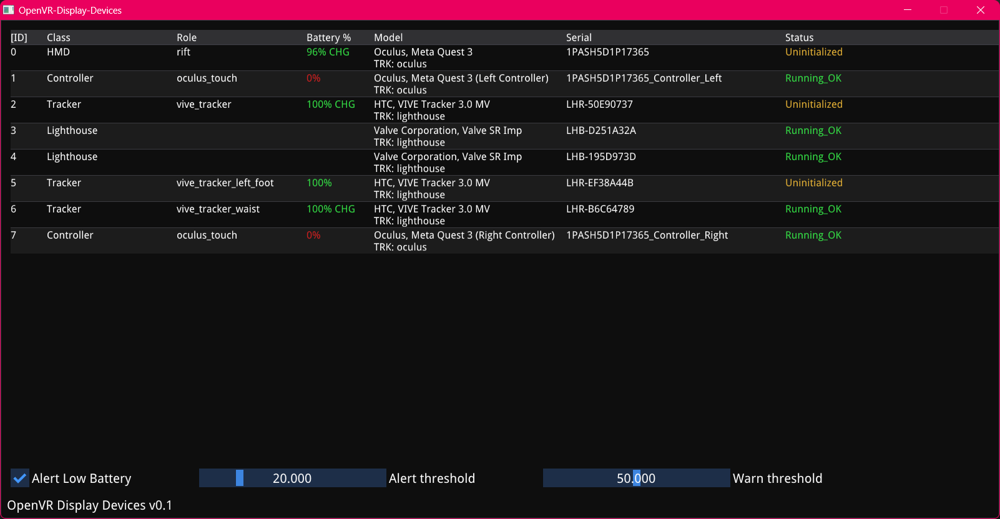
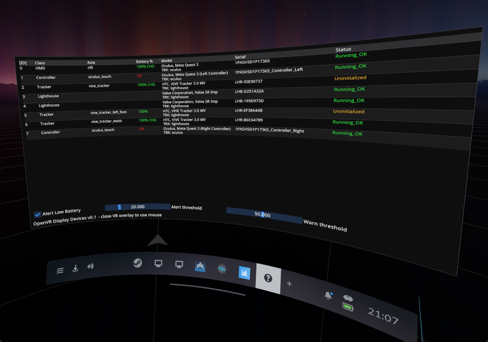

# OpenVR Display Devices

 

## WTF is that

This is a SteamVR Overlay app (and a "standalone" window) that will list all your connected OpenVR devices informations such as: Model, vendor, tracking type, serial number, battery status and tracking state.

It can send notifications of low battery (<20%) and warn (<50%) through native windows toasts or XSOverlay, it will also notify if a tracker is charging but too slowly that it's discharging.

The configuration file is located in: `%appdata%\OpenVR-Display-Devices\` the `app.ini` file.

## Build

- Clone the repository recursively to get the submodules
- Alternatively in the CLI after cloning: `git submodule init --update` iirc
- Load the project in Visual Studio 2022
- Build it
- ???

Notes that the project uses VCPKG, so you might have to need to open the dev prompt from your project and do something like `vcpkg integrate install` maybe idk

To create an installer:
- Download latest NSIS thingy
- Open it, click the link to compile a script
- Load the "installer/installer.nsi" file
- Compile and execute
- done

## TODO

- Try it more
- VR Runtime path (xxx.exe -runtimepath) doesn't return anything ???
- WIP to be tested: Implement a "previous value" for battery statuses, to detect if the device is charging BUT current% is inferior to last%, to send a more specific notification about slow charging
- The code really needs cleanups, the WebSocket part is absolutely awful, it works, but PRs welcomes (I won't bite you)

## License & contact

MIT License

Some code has been used from https://github.com/hyblocker/OpenVR-SpaceCalibrator for the main ImGUI/glfw/opengl window code.

Contact:
- farts at otter dot sh
- issues maybe, any other way you can find (good luck)
